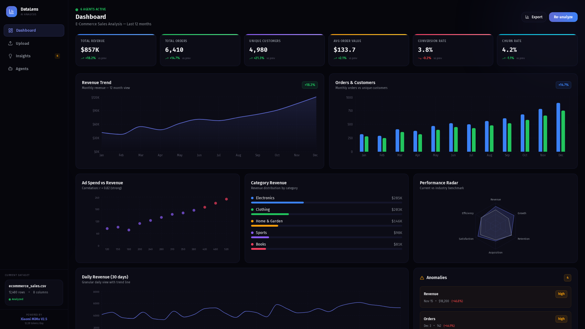
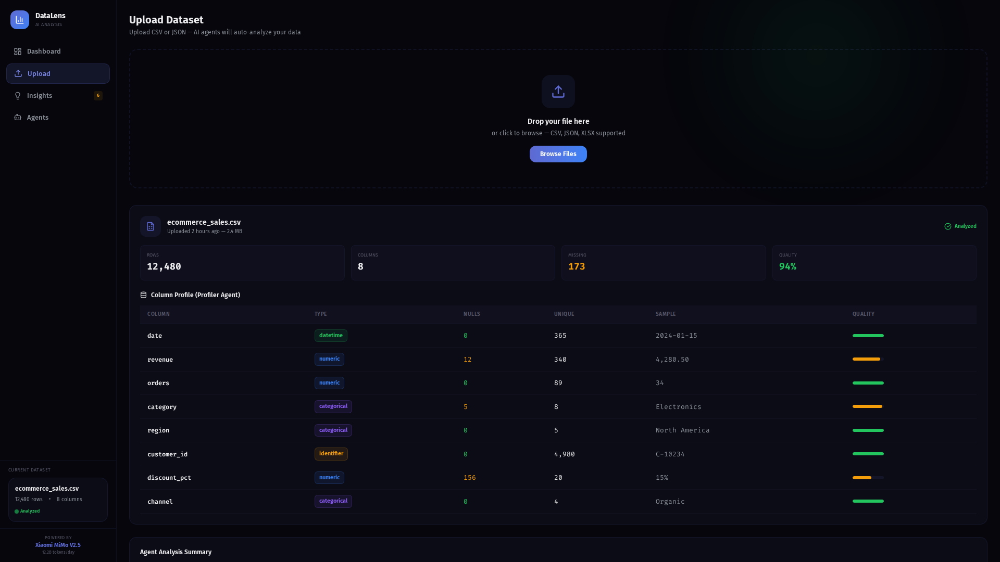
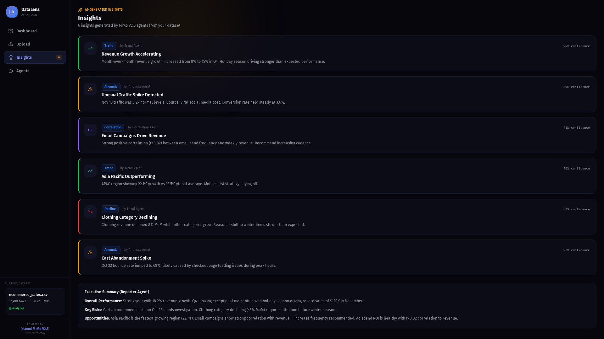

# DataLens

> **Powered by Xiaomi MiMo V2.5** — Data Analysis Platform

Upload a CSV and instantly get data analysis — column profiling, anomaly detection, correlation analysis, trend spotting, and visual reports.



## Features

- **Drag-and-Drop Upload** — Simply drop your CSV file to start
- **Column Profiling** — Auto-detect data types, quality, and distributions
- **Anomaly Detection** — Statistical outlier detection with z-score analysis
- **Trend Analysis** — Time-series decomposition and pattern recognition
- **Correlation Engine** — Pearson/Spearman correlation and feature importance
- **Smart Charts** — Auto-select optimal chart types for your data
- **Export Reports** — Generate summary reports from your analysis

## Dashboard Features

- **6 KPI Cards** — Revenue, Orders, Customers, AOV, Conversion, Churn
- **Revenue Area Chart** — 12-month trend with gradient fill
- **Orders Bar Chart** — Monthly orders vs customers comparison
- **Scatter Plot** — Ad spend vs revenue correlation
- **Category Breakdown** — Revenue distribution with progress bars
- **Radar Chart** — Performance vs industry benchmark
- **Daily Line Chart** — 30-day granular revenue + visitors
- **Anomaly Panel** — Detected anomalies with severity badges

## Screenshots






## Tech Stack

- **Framework:** Next.js 16, React 19
- **Styling:** Tailwind CSS 4
- **Charts:** Recharts (area, bar, line, scatter, radar)
- **Typography:** Fira Sans + Fira Code
- **Icons:** Lucide React

## Getting Started

```bash
git clone https://github.com/ferah1223/datalens.git
cd datalens
npm install
npm run dev
```

Open [http://localhost:3000](http://localhost:3000) to start analyzing.

---

**Powered by Xiaomi MiMo V2.5**
